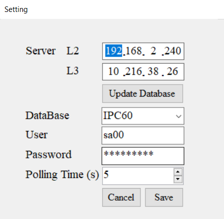
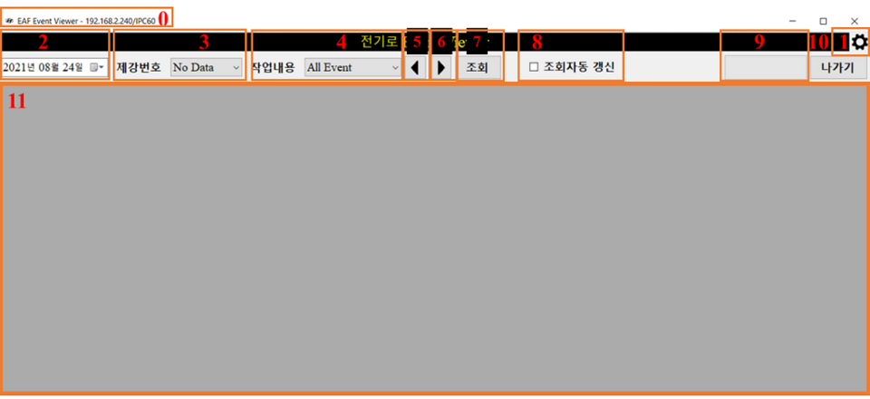

# doc-eaf-event-viewer
This is public documentation of eaf-event-viewer repository. [https://github.com/thanh-repo/eaf-event-viewer]

# eaf-event-viewer

# Deploy a WinForms (C#) app to show data from MSSQL.

## Requirements:
+ Setting database information, test database connection, select database.
+ Select product by datetime.
+ Filter product by event.
+ Show data on grid.
+ Auto mode to update the latest data.

## Project Description:
This project build a WinForms which query the data from MSSQL DB.

# CONTENTS OF THIS FILE

1. Introduction
2. Requirements
3. Installation
4. Configuration
5. Using Guide
6. Troubleshooting
6. End

# 1. Introduction
- EAF Event Viewer is a program to show the EAF Event Process of 60 ton steel making.
- It is include { "시각", "작업내용", "시용량", "STEP", "TAP(V)", "ARC(A)", "전류 kA", "전력 kWh", "역률 %", "온도 °C" }.
- Event address: ../IPC60/Table/[dbo].[EAF_Event]
- Database address: ../IPC60/Table/[dbo].[EAF_Event_Result]
- SQL procedure address: ../IPC60/Programmability/Stored Procedure/[dbo].[PROC_EVENT_VIEWER]

# 2. Requirements
- Windows 10.

# 3. Installation
- Run file at directory: ../EAF Installer.msi

# 4. Configuration
- After installing the program, run the application: ../User/Desktop/EAF Event Viewer.
- Use the "Gear button" at the top right of the application to go to setting control.

------------

------------
- There are two server addresses, L2 and L3, the program will try to connect to server L3. If the server at L3 address is not available, it will connect to server L2.
- "Update Database button" is to get all of the databases at the available server then show them to "DataBase".
After the user enters User name and Password, the "save button" checks the database connection (database connection, database authentication,...), saves setting information, and connects to the server.

# 5. Using Guide
This is the main screen of the EAF Event Viewer. The following is the function of the numeric box.

------------
##### 0: Program header name with current database address.
##### 1: Setting button: Open setting control.
##### 2: DateTimePicker: Select date to get heater at that day.
##### 3: The heater name will show in this box.
##### 4: After select heater, the event of that heater will show in this box.
##### 5: View the previous heater.
##### 6: View the next heater.
##### 7: Show heater database.
##### 8: Polling mode, this mode will check the latest heater to show and refresh after every Polling Time (s) which set in setting control
##### 9: The progress of get heater information and polling time.
##### 10: Exit button: exit program.
##### 11: Main box show database.

# 6. Troubleshooting
- When running the program, some error might occur. The error will show as a popup box with **Error Code**.
- The below is Error Code might show, the following is Description and Solution.

#### Error Code

------------
##### 0xXX
- **Error name**: 
- **Description**:
- **Solution**:

------------
##### 0x00
- **Error name**: Cannot connect to database server. There is no connection to the server, neither ip_L2 nor ip_L3.
- **Description**: Can not ping to server L2 or L3.
- **Solution**: Check the connection or add route: cmd(administrator):route add "IP Destination" mask "Mask" "Default Gateway".

------------
##### 0x01
- **Error name**: Please check the database connection.
- **Description**: The program can ping to server, but the database in the server might not started.
- **Solution**: Check server database

------------
##### 0x02
- **Error name**: Please check the database connection or database structure.
- **Description**: Lost connection at *HeaterInfoBackground*. There is two problem cause this problem:
-- 1. Can not ping to server.
-- 2. Blank database or error when open MSSQL connection (authentication).
- **Solution**: Check database connection(Wifi, Ethernet,...)

------------
##### 0x03
- **Error name**: Please check the database connection or database structure.
- **Description**: This error is the same with **0x02**. Lost connection at *Update_Heater_Info*.
- **Solution**: Refer to **0x02**

------------
##### 0x04
- **Error name**: Please check the database connection or database structure and procedure.
- **Description**: There is no procedure in the database or lost database connection.
- **Solution**: Add procedure to database, procedure directory: ../procedure.sql

------------
##### 0x05
- **Error name**: Please check the database connection.
- **Description**: This error is the same with **0x02**. Lost connection at *ShowData*.
- **Solution**: Refer to **0x02**

------------
##### 0x06
- **Error name**: The program already exists. Please try to reopen the program after a few seconds or close an existing program before starting a new program.
- **Description**: This program allows only one window to be opened at a time.
- **Solution**: Try to close the recent program before open the new one. If there is no program opened, try to find it out in Task Manager.

------------
##### 0x07
- **Error name**: No Procedure in database. Please add the procedure to the database and try again later. The procedure directory:........ The program will close.
- **Description**: There is no procedure in the database.
- **Solution**: Add procedure to database, procedure directory: ../procedure.sql.

------------
##### 0xFF
- **Error name**: Can not ping to server when the program gets data from the database.
- **Description**: Can not ping to server when the program gets data from the database.
- **Solution**: Check database connection(Wifi, Ethernet,...)

### End
